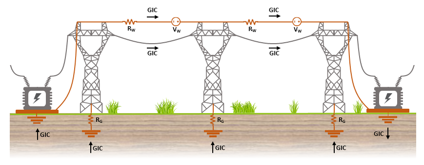
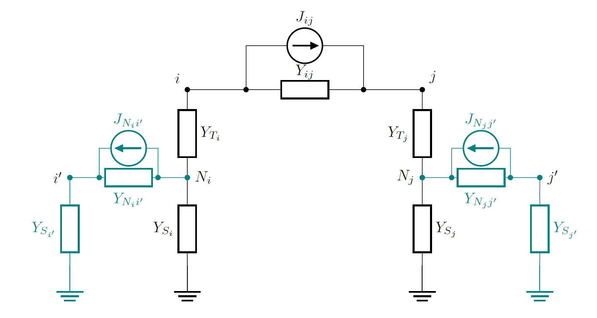

# ShW-MAGICA
ShW-MAGICA is a Python implementation of the Lehtinen–Pirjola modified method for computing Geomagnetically Induced Currents (GICs) in transmission networks, including the explicit modelling of shield wires (ShW).'

The code is based on the original GEOMAGICA framework (4) and extends it by incorporating the LPm method, explicit shield wire equivalent circuits, Delaunay interpolation of spatially varying induced fields and optimised electromotive force calculation along power lines.

  

**Figure 1.** Schematic of GICs flowing both along phase conductors and ShW. 

  

**Figure 2.** Equivalent circuit representation used for explicit modelling of shield wires.

# Input Files

GRID.txt - Defines the network nodes (i, j, N_i, N_j in Figure 2). Each row corresponds to one node.
Column	Description: Node number, Node name, Node code,	Country,	Latitude (°),	Longitude (°), Grounding resistance (1/Y_S_i and 1/Y_S_j in Figure 2), Transformer resistance

CONNECTIONS.txt - Defines the network connections (i-j, i-N_i and j-N_j in Figure 2). Each row corresponds to one power line or transformer winding.
Column	Description: substation name, transformer type, winding, from node, to node, line length, shield wire type, phase exception, line resistance (1/Y_{ij}, 1/Y_T_i and 1/Y_T_j in Figure 2), nominal voltage

GRID_ShW.txt - Defines the network nodes regarding ShW (i', j' in Figure 2). Each row corresponds to one new node.
Column	Description: node name, node number, latitude (°), longitude (°), grounding resistance (1/Y_S_i' and 1/Y_S_j' in Figure 2), transformer resistance

CONNECTIONS_ShW.txt - Defines the network connections regarding ShW  (N_i-i',N_j-j' in Figure 2). Each row corresponds to one new line of ShW.
Column	Description: shield wire name, shield wire number, from node, to node, resistance (1/Y_N_{i}i' and 1/Y_N_{j}j' in Figure 2), corresponding transmission line (i-j in Figure 2), RG value, Req value, RW value

Point_Coord.pkl - Contains the coordinates of the electric field interpolation grid
The file stores two arrays: latitude, longitude

E_field_Coord.pkl - The electric field file contains the geoelectric field evaluated at the interpolation points defined in Point_Coord.pkl.
Each file stores both field components: northward component (E_n), eastward component (E_e)

# Code versions

The repository contains four standalone Python scripts corresponding to the four simulation configurations used in the published work.
The scripts intentionally remain largely independent to preserve reproducibility of the results reported in the thesis and associated papers.
They differ according to the geoelectric field model (uniform or spatially varying) and whether shield wires are explicitly included in the network model.

### 1. Uniform electric field (without shield wires)

Computes GICs using the LPm formulation assuming a uniform geoelectric field. 

### 2. Uniform electric field (with shield wires)

Extends the baseline implementation by explicitly modelling shield wires through equivalent electrical circuits.

### 3. Spatially varying electric field (without shield wires)

Computes GICs using electric field from a geomagnetic storm. The electric field is interpolated to the transmission line integration points before calculating the induced voltages.

### 4. Spatially varying electric field (with shield wires)

Complete implementation of ShW-MAGICA. Combines the LPm formulation, Delaunay interpolation of spatially varying electric fields, and explicit shield wire modelling.

# Resources
1. Santos, R. R., Pais, M. A., Cardoso, J. M., Ribeiro, J. A., & Pinheiro, F. J. (2025). The influence of Shield Wires on GIC simulations for realistic power grids. Electric Power Systems Research, 244, 111540.

2. Santos, R., Pais, M. A., Ribeiro, J. A., Cardoso, J., Perro, L., & Santos, A. (2022). Effect of shield wires on GICs: Equivalent resistance and induced voltage sources. International Journal of Electrical Power & Energy Systems, 143, 108487.

3. Alves Ribeiro, J., Pinheiro, F. J., Pais, M. A., Santos, R., Cardoso, J., Baltazar‐Soares, P., & Monteiro Santos, F. A. (2023). Toward more accurate GIC estimations in the Portuguese power network. Space Weather, 21(6), e2022SW003397.

4. Bailey, R. L., Halbedl, T. S., Schattauer, I., Römer, A., Achleitner, G., Beggan, C. D., ... & Leonhardt, R. (2017, June). Modelling geomagnetically induced currents in midlatitude Central Europe using a thin-sheet approach. In Annales Geophysicae (Vol. 35, No. 3, pp. 751-761). Göttingen, Germany: Copernicus Publications.

# Credits & Authors

This work is based on the original GEOMAGICA framework developed from

P. Weidelt, C. Beggan, K. Turnbull, A. McKay, R. Bailey
https://github.com/geomagpy/GEOMAGICA

The present implementation (ShW-MAGICA) was developed by

Rute Rodrigues dos Santos, Alexandra Pais, Joana Alves Ribeiro, Fernando Pinheiro

Department of Physics, University of Coimbra
CITEUC
